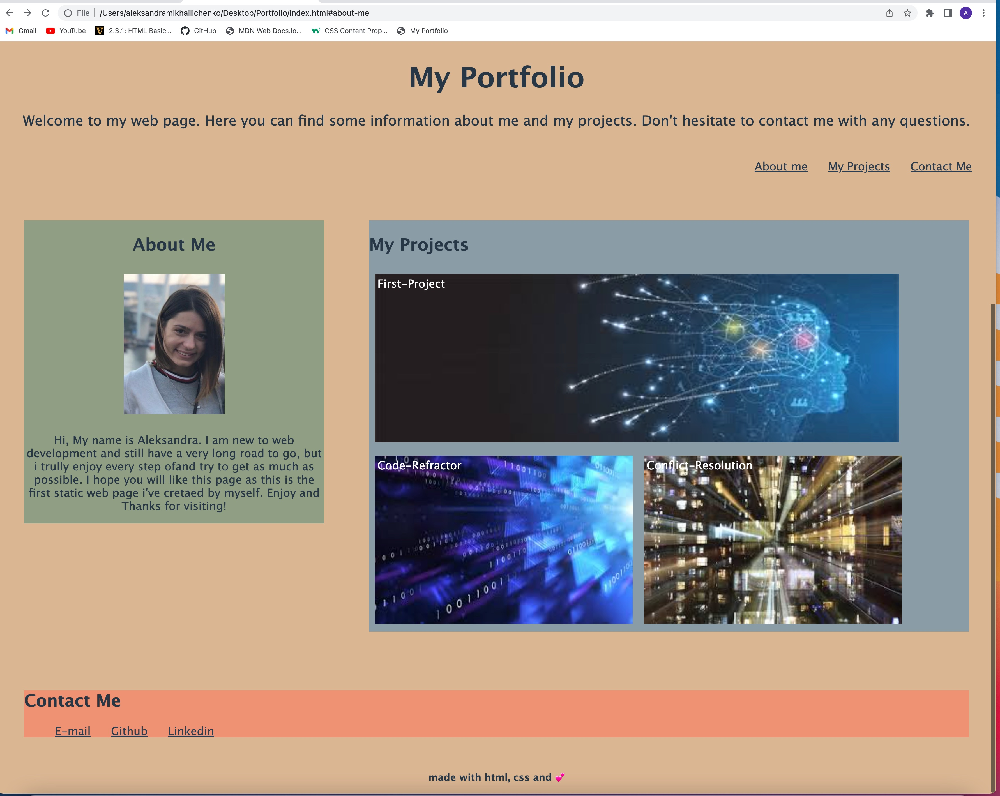

# Portfolio
## BootCamp week 2 assignment: create portfolio page
 

### Deployment

Application deployed at live URL.

Application loads with no errors.

Application GitHub URL submitted.

GitHub repository contains application code.

Application Quality: 
Application resembles the mock-up functionality provided in the Challenge instructions.

Repository Quality: 
Repository has a unique name.
Repository follows best practices for file structure and naming conventions.
Repository follows best practices for class/id naming conventions, indentation, quality comments, etc.
Repository contains multiple descriptive commit messages.
Repository contains a quality readme with description, screenshot, link to deployed application.

### Process

A new web page with title "My Portfolio" was created. Web page contain several sections: header, navigation bar, personal info, samples of the projects, and contact me. All links are functional and will transfer to the assigned content. Images of the projects have corresponding projects name and contains links and as well will deploy to either published web-page or github repo whith assigned projects in it. The bigest size image is represent the very first project. Web page is flexible and will addapt to any viewport size. "Contact me" section include three links and will deploy to the assigned webpage. 

 

 
[link to webpage] 
(https://aleksamik.github.io/Portfolio/)
 
[link to github repo]
(https://github.com/AleksaMik/Portfolio)
